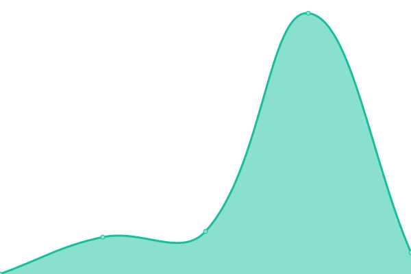
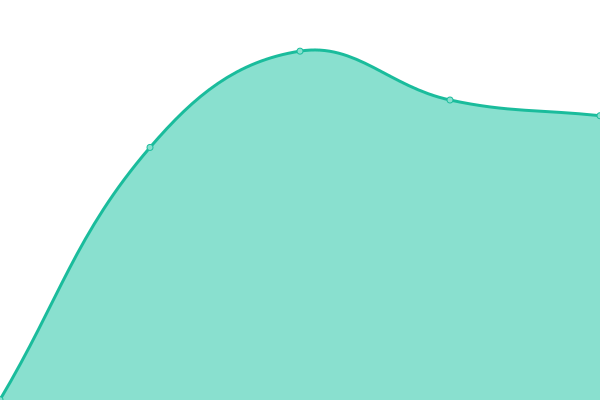

# [📈 Live Status](https://ekalaya2015.github.io/upptime): <!--live status--> **🟩 All systems operational**

This repository contains the open-source uptime monitor and status page for [ekalaya2015](https://ekalaya2015.github.io/upptime), powered by [Upptime](https://github.com/upptime/upptime).

With [Upptime](https://upptime.js.org), you can get your own unlimited and free uptime monitor and status page, powered entirely by a GitHub repository. We use [Issues](https://github.com/ekalaya2015/upptime/issues) as incident reports, [Actions](https://github.com/ekalaya2015/upptime/actions) as uptime monitors, and [Pages](https://ekalaya2015.github.io/upptime) for the status page.

<!--start: status pages-->
<!-- This summary is generated by Upptime (https://github.com/upptime/upptime) -->
<!-- Do not edit this manually, your changes will be overwritten -->
<!-- prettier-ignore -->
| URL | Status | History | Response Time | Uptime |
| --- | ------ | ------- | ------------- | ------ |
|  [Malang](https://malang.epuskesmas.id) | 🟩 Up | [malang.yml](https://github.com/ekalaya2015/upptime/commits/HEAD/history/malang.yml) | 

 1072ms
     
 | 

<a href="https://ekalaya2015.github.io/upptime/history/malang">100.00%</a>
    

|  [Klaten](https://klaten.epuskesmas.id) | 🟩 Up | [klaten.yml](https://github.com/ekalaya2015/upptime/commits/HEAD/history/klaten.yml) | 

 1064ms
     
 | 

<a href="https://ekalaya2015.github.io/upptime/history/klaten">100.00%</a>
    

|  [Badung](https://badung.epuskesmas.id) | 🟩 Up | [badung.yml](https://github.com/ekalaya2015/upptime/commits/HEAD/history/badung.yml) | 

 3453ms
     
 | 

<a href="https://ekalaya2015.github.io/upptime/history/badung">97.39%</a>
    

|  [Pasuruan](https://pasuruan.epuskesmas.id) | 🟩 Up | [pasuruan.yml](https://github.com/ekalaya2015/upptime/commits/HEAD/history/pasuruan.yml) | 

 1040ms
     
 | 

<a href="https://ekalaya2015.github.io/upptime/history/pasuruan">100.00%</a>
    

|  [Lima Puluh Kota](https://limapuluhkota.epuskesmas.id) | 🟩 Up | [lima-puluh-kota.yml](https://github.com/ekalaya2015/upptime/commits/HEAD/history/lima-puluh-kota.yml) | 

 1070ms
     
 | 

<a href="https://ekalaya2015.github.io/upptime/history/lima-puluh-kota">100.00%</a>
    

|  [Gowa](https://gowa.epuskesmas.id) | 🟩 Up | [gowa.yml](https://github.com/ekalaya2015/upptime/commits/HEAD/history/gowa.yml) | 

 2063ms
     
 | 

<a href="https://ekalaya2015.github.io/upptime/history/gowa">100.00%</a>
    

<!--end: status pages-->

[**Visit our status website →**](https://ekalaya2015.github.io/upptime)

## 📄 License

- Powered by: [Upptime](https://github.com/upptime/upptime)
- Code: [MIT](./LICENSE) © [ekalaya2015](https://ekalaya2015.github.io/upptime)
- Data in the `./history` directory: [Open Database License](https://opendatacommons.org/licenses/odbl/1-0/)
